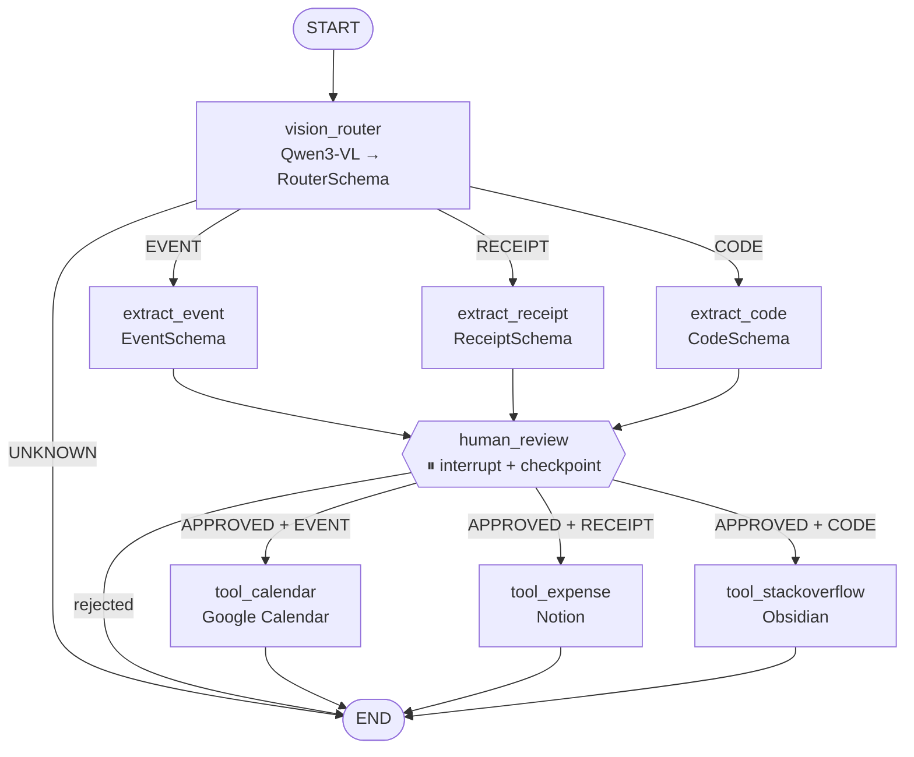

# Shoty (PixelPipe)

**Turn screenshots into actions. A local vision-LLM agent built with LangGraph classifies a screenshot, extracts structured data, waits for your approval, and then routes the data to the right tool.**

Take a screenshot of a meeting invite, a receipt or a stack trace. Shoty recognises which kind it is, pulls out the fields that matter (event title and time, merchant and total, or the error and a suggested fix), shows them for **human-in-the-loop review**, and on approval sends them to Calendar, Notion or Obsidian. Everything runs locally with **Qwen3-VL 8B via Ollama**.

---

## Features

- **Vision router:** strict classification into `EVENT`, `RECEIPT`, `CODE` or `UNKNOWN` through Pydantic structured output
- **Type-specific extractors** with typed schemas:
  - `EventSchema`: title, date, time, attendees
  - `ReceiptSchema`: merchant, total, date, items
  - `CodeSchema`: language, error message, suggested fix
- **Human-in-the-loop:** the graph is compiled with `interrupt_before=["human_review"]` and only continues once the user approves
- **Tool dispatch:** Google Calendar (events), Notion (expenses) and Obsidian (code fixes). These are currently stub actions that log what would be written.
- **Runs in two ways:** as a CLI (`python main.py`) or in **LangGraph Studio** (`langgraph dev`) for visual debugging
- **Fully local:** `temperature=0` for deterministic JSON and no cloud API keys

## Architecture



| Module | Responsibility |
|---|---|
| `src/agent/graph.py` | `StateGraph` wiring, routing functions, and compilation with a `MemorySaver` checkpointer |
| `src/agent/nodes.py` | Router, extractor, review and tool nodes. Images are sent as base64 `image_url` content. |
| `src/agent/schemas.py` | Pydantic models for structured LLM output |
| `src/agent/state.py` | `AgentState`: `image_path`, `classification`, `extracted_data`, `user_feedback`, `tool_output` |
| `src/agent/config.py` | `ChatOllama(model="qwen3-vl:8b", temperature=0)` |
| `main.py` | CLI. Streams to the checkpoint, prints the extraction, asks for approval, then resumes the thread. |
| `langgraph.json` | LangGraph Server and Studio entry point |

## Getting started

```bash
# 1. Local model
ollama pull qwen3-vl:8b

# 2. Install
pip install -e . langchain-ollama "langgraph-cli[inmem]"

# 3a. CLI
python main.py          # enter a screenshot path when prompted

# 3b. LangGraph Studio
langgraph dev
```

## Tests

```bash
make test               # unit tests
make integration_tests  # graph integration tests
```

## Tech stack

Python 3.10+ · LangGraph · LangChain · Ollama (Qwen3-VL 8B) · Pydantic · LangGraph Studio

## License

MIT. See [LICENSE](LICENSE).
